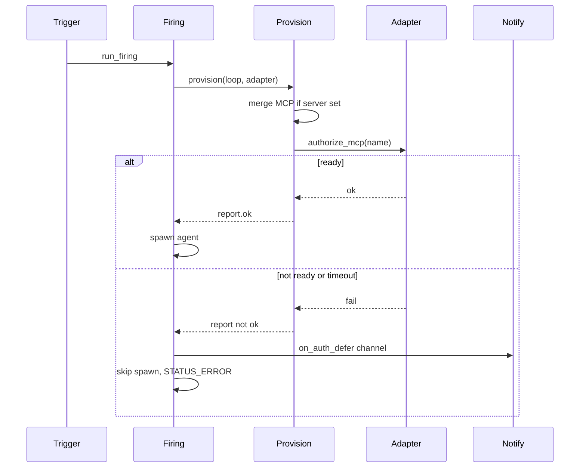

# MCP Authorize Provisioning — Per-Issue Implementation Plan

> **For Claude:** REQUIRED SUB-SKILL: Use superpowers:executing-plans to implement this plan task-by-task.

**Goal:** Authorize declared MCP Capabilities during Provisioning so Firings don’t hit permission errors; on failure skip + notify via a visible channel.

**Architecture:** Provisioning merges MCP config when `server` is set, then calls `Adapter.authorize_mcp`. Cursor runs `mcp enable` / `mcp login` / verify `ready` (60s). Failure skips the Firing (no park) and notifies via `on_auth_defer.notify`. `desktop` = Windows toast from WSL.

**Tech Stack:** Python 3, pytest, existing Loopr modules (`config`, `provision`, `adapters`, `firing`, `notify`).

**Parent PRD:** [.scratch/mcp-authorize-provisioning/PRD.md](../../.scratch/mcp-authorize-provisioning/PRD.md)

**Issues:** [.scratch/mcp-authorize-provisioning/issues/](../../.scratch/mcp-authorize-provisioning/issues/)

Validate with `uv run pytest -m 'not e2e'` after each issue.

---



---

## Issue 01 — Global MCP + Adapter authorize (happy path)

**Ticket:** [01-global-mcp-adapter-authorize.md](../../.scratch/mcp-authorize-provisioning/issues/01-global-mcp-adapter-authorize.md)

### Design choices (locked)

- `McpCapability.server: dict | None = None` — omit/`None` ⇒ authorize-only, no Workspace `mcp.json` write.
- `Loop.on_auth_defer_notify: str | None` from YAML:

```yaml
on_auth_defer:
  notify: cli
```

- Require `on_auth_defer.notify` at load when any MCP Capability exists (channel must be in `known_channels()`).
- `provision(loop, adapter)` — after skill/mcp-merge/tool steps, for each `McpCapability` call `adapter.authorize_mcp(name)` and record a `ProvisionAction`.
- Adapter protocol adds `authorize_mcp(self, name: str) -> AuthorizeResult` with `ok: bool` and `detail: str`.
- Cursor: subprocess to `{binary} mcp enable|login|list` (injectable runner for tests); happy path only in this issue (timeout/not-ready wiring can stub `ok=True` until 02, but implement real enable/login/ready sequence here).
- Command: `authorize_mcp` returns `ok=True` immediately (no-op).
- FakeAdapters in tests must grow the method.

### Tasks (TDD)

1. **Config — omit server + on_auth_defer**
   - Test: MCP without `server` parses; `on_auth_defer.notify: cli` stored on Loop.
   - Test: MCP present without `on_auth_defer` → `ConfigError`.
   - Test: unknown notify channel → `ConfigError`.
   - Test: existing MCP-with-`server` still parses (add `on_auth_defer` to fixture).
   - Implement in [config.py](../../src/loopr/config.py): optional `server`, parse `on_auth_defer`, validate against `known_channels()`, set `Loop.on_auth_defer_notify`.
   - Update [test_config.py](../../tests/test_config.py) fixtures that declare MCP to include `on_auth_defer`.

2. **Provision — global MCP does not write Workspace config**
   - Test: `McpCapability(name=..., server=None)` → no `.cursor/mcp.json` created; action outcome like `authorize`-related after adapter wired.
   - Change `_ensure_mcp` in [provision.py](../../src/loopr/provision.py): if `server is None`, skip merge (outcome `global` or defer detail to authorize step).
   - Keep merge path when `server` is a dict.

3. **Adapter authorize hook**
   - Extend [adapters/base.py](../../src/loopr/adapters/base.py) Protocol with `authorize_mcp`.
   - Implement no-op on [command.py](../../src/loopr/adapters/command.py).
   - Implement Cursor in [cursor.py](../../src/loopr/adapters/cursor.py): injectable `run` callable; enable → login → parse `mcp list` for `{name}: ready`.
   - Tests in [test_adapters.py](../../tests/test_adapters.py) with fake subprocess outputs.
   - Update FakeAdapter / ResultAdapter in [test_firing.py](../../tests/test_firing.py) (and any other fakes) with `authorize_mcp` → ok.

4. **Wire provision ↔ adapter ↔ firing**
   - `provision(loop, adapter)` calls authorize per MCP Capability; failure → action outcome in `_BAD_OUTCOMES` (e.g. `unauthorized`).
   - [firing.py](../../src/loopr/firing.py): `provision(loop, adapter)`.
   - Test: FakeAdapter authorize ok + global MCP → `run_firing` succeeds and agent output appears.
   - Test: MCP with `server` still merges then authorizes (FakeAdapter ok).

5. **Docs touch (light):** README Capabilities section — global MCP via omit-`server` + required `on_auth_defer` (can finish wording in 04).

**Done when:** AC of issue 01 checked; `uv run pytest -m 'not e2e'` green.

---

## Issue 02 — Auth defer: skip Firing + Notification

**Ticket:** [02-auth-defer-skip-notify.md](../../.scratch/mcp-authorize-provisioning/issues/02-auth-defer-skip-notify.md)

### Design choices (locked)

- Cursor authorize wall-clock **60s** for the enable+login+list sequence (`subprocess.run(..., timeout=60)` or cumulative budget); timeout → not ok.
- Not ready / timeout → existing skip path (`STATUS_ERROR`, no spawn) **plus** Notification on `loop.on_auth_defer_notify`.
- Inject `notifier` into `run_firing` (same pattern as [handoff.py](../../src/loopr/handoff.py) `Notifier`), default `deliver`.
- Notification content: source=loop name, channel=`on_auth_defer_notify`, summary/detail with MCP names + `cursor-agent mcp login <name>` hint, `run_id` / `log_path` when available.
- Only notify on MCP authorize failure (outcome `unauthorized` / timeout), not necessarily every tool-missing failure — keep tool failures as today (skip, no auth-defer notify) unless the report includes an unauthorized MCP action.
- Add **`loopr provision <loop>`** CLI (mentioned in PRD; not implemented today): load config, resolve adapter, run `provision`, print report, exit non-zero if not ok (no Notification required for CLI provision unless useful — prefer print report only).

### Tasks (TDD)

1. **Cursor timeout / not-ready**
   - Tests with stub runner: list shows not ready → `ok=False`; hang → timeout → `ok=False`.

2. **`run_firing` skip + notify**
   - FakeAdapter `authorize_mcp` returns fail; injectable notifier captures `Notification`.
   - Assert: `STATUS_ERROR`, log has provisioning failed, agent argv never run (FakeAdapter can set a flag in `build_invocation`), notifier called once with expected channel/hint.
   - Assert: tool-missing failure still skips but does **not** call auth-defer notifier.

3. **Wire notifier from CLI/daemon paths**
   - `run_firing(..., notifier=...)`; `fire_with_handoffs` / `cli run` keep default `deliver` (no API break).

4. **`loopr provision` command**
   - Add Typer command in [cli.py](../../src/loopr/cli.py); test via existing CLI test style in [test_cli.py](../../tests/test_cli.py).

**Done when:** Issue 02 AC met; unit suite green.

---

## Issue 03 — Desktop channel (Windows toast from WSL)

**Ticket:** [03-desktop-windows-toast.md](../../.scratch/mcp-authorize-provisioning/issues/03-desktop-windows-toast.md)

### Design choices (locked)

- Register `desktop` in [notify.py](../../src/loopr/notify.py) `_BUILDERS`.
- `DesktopChannel` takes injectable `toast: Callable[[str, str], None]` (title, body).
- Default toast implementation: invoke `powershell.exe` with a small WinRT/Toast or `BurntToast`-free script that shows a Windows 10+ toast on the host (WSL → Windows). Failures raise or log via channel — Notification delivery error should not crash the daemon hard; log and continue after skip (match robust CLI channel behavior).
- Default runner selected at `get_channel("desktop")` construction; tests inject a list-append toast.

### Tasks (TDD)

1. **Channel registration + inject**
   - Tests in [test_notify.py](../../tests/test_notify.py): `desktop` in `known_channels()`; deliver calls injected toast with title/body derived from `Notification.render()` or a dedicated auth-defer-friendly title.
2. **Default Windows toast helper**
   - Small pure function module or private helper; unit-test that it builds the expected `powershell.exe` argv (mock `subprocess.run`), not that a toast appears.
3. **Config accepts `notify: desktop`**
   - Config test: `on_auth_defer.notify: desktop` loads once channel exists.

**Done when:** Issue 03 AC met; no real toast required in CI.

---

## Issue 04 — Wire paper Loops

**Ticket:** [04-wire-paper-loops.md](../../.scratch/mcp-authorize-provisioning/issues/04-wire-paper-loops.md)

### Tasks

1. Update operator `loopr.yaml` (Projects root) for `tabular-paper-radar` and `paper-deep-review`:

```yaml
capabilities:
  - type: mcp
    name: arxiv-local
on_auth_defer:
  notify: desktop
```

2. Replace comments that say not to declare the MCP Capability with a short note pointing at global authorize-only.
3. Align [README.md](../../README.md) example / capabilities table with omit-`server` + authorize + `on_auth_defer`.
4. Manual verify (operator): break auth → `loopr run tabular-paper-radar` → Windows toast + skip; `cursor-agent mcp login arxiv-local` → re-run succeeds.
5. Optional ADR `docs/adr/0008-mcp-authorize-in-provisioning.md` summarizing omit-server, skip+notify, Adapter authorize, required `on_auth_defer`, desktop=Windows toast (PRD Further Notes).

**Done when:** Issue 04 AC met; config loads; manual check noted in issue comments if performed.

---

## Cross-cutting notes

- Prefer extending existing modules; no new subsystem packages.
- Keep FakeAdapter as the primary seam for firing behavior; never call real `cursor-agent mcp` or Windows toast in default unit tests.
- Existing MCP-with-server tests must add `on_auth_defer` once validation lands (issue 01).
- Commit per issue (or per green task cluster) when the user asks for commits — do not commit unprompted.

## Issue checklist

- [ ] 01 — Global MCP Capability + Adapter authorize
- [ ] 02 — Auth defer: skip Firing + Notification
- [ ] 03 — Desktop Notification channel (Windows toast from WSL)
- [ ] 04 — Wire paper Loops to global `arxiv-local`
