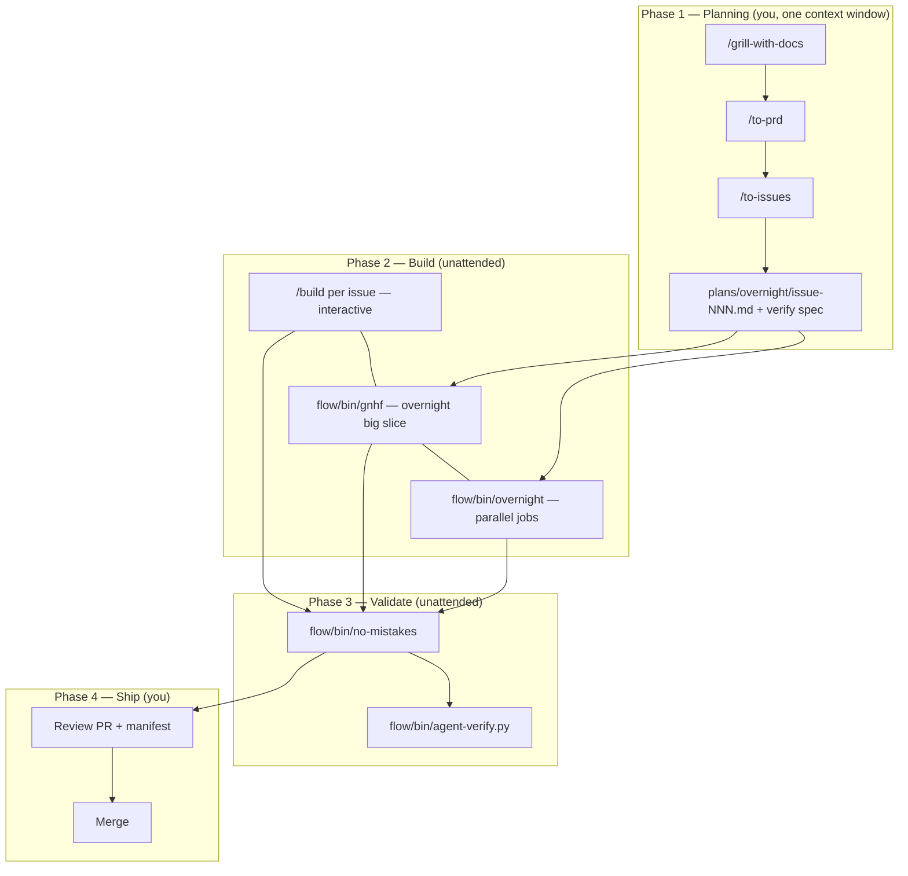

# flow — portable agentic engineering toolkit

Reusable **build → validate → ship** automation for any git repo using the Cursor CLI
(`agent -p`). Copy this `flow/` folder into a project, run `install.sh`, and use the same
tools everywhere.

Inspired by Kun Chen's *agentic engineering* setup (gnhf, no-mistakes, treehouse) — adapted
for **Cursor IDE** users with agent-driven capability verification.

## What's inside

```
flow/
├── README.md                 ← you are here
├── install.sh                ← bootstrap .cursor config in any repo
├── bin/
│   ├── gnhf                  ← overnight fresh-context builder
│   ├── no-mistakes           ← review + capability verify + PR
│   ├── overnight             ← parallel gnhf + no-mistakes (worktrees)
│   └── agent-verify.py       ← agent exercises + judges capabilities
├── lib/
│   ├── config.sh             ← loads .cursor/flow.json + auto-detect
│   └── detect.sh             ← sniff Makefile / package.json / Cargo / Go
├── hooks/
│   ├── format-edited.sh      ← Cursor afterFileEdit
│   └── stop-gate.sh          ← Cursor stop
└── templates/
    ├── flow.json.example
    ├── capability-verify.example.json
    ├── hooks.example.json
    ├── no-mistakes.toml
    └── overnight-plan.example.md
```

---

## Setup (any repo)

### 1. Add `flow/` to the repo

**Option A — vendored (recommended):** copy or submodule this directory into the repo root.

**Option B — global install:** keep `flow/` in one place and symlink tools:

```bash
/path/to/flow/install.sh global
# adds ~/.local/bin/flow-gnhf, flow-no-mistakes, flow-overnight, flow-agent-verify
```

### 2. Bootstrap per-repo config

From the **repo root**:

```bash
./flow/install.sh repo
```

Creates (if missing):

| File | Purpose |
|------|---------|
| `.cursor/flow.json` | validate / e2e / format / budgets |
| `.cursor/capability-verify.json` | agent exercise + judge spec |
| `.cursor/hooks.json` | format-on-edit + stop gate |
| `.cursor/commands/no-mistakes.toml` | `/no-mistakes` slash command |
| `plans/overnight/` | overnight plan files |

### 3. Prerequisites

| Requirement | Notes |
|-------------|-------|
| **git** | all tools operate on a clean worktree |
| **Cursor CLI** | `curl https://cursor.com/install -fsS \| bash` → `agent` on PATH |
| **`CURSOR_API_KEY`** | required for unattended / overnight runs |
| **python3** | `agent-verify.py` (stdlib only) |
| **jq** | optional but recommended for config + hooks |

### 4. Configure `.cursor/flow.json`

Auto-detection fills gaps (Makefile `check`, `npm test`, `cargo test`, etc.), but you should
set explicit commands for your repo:

```json
{
  "base_branch": "main",
  "validate": "make check",
  "e2e": "npm run test:e2e",
  "format": "npm run format",
  "base_context": "AGENTS.md",
  "capability_verify_spec": ".cursor/capability-verify.json",
  "gnhf": { "max_steps": 25, "budget_usd": 20 },
  "overnight": { "parallel": 2, "budget_usd": 15 }
}
```

### 5. Enable hooks (optional)

If `install.sh` created `.cursor/hooks.json`, restart Cursor or reload hooks. Set
`FLOW_STOP_BLOCK=1` when you want the stop hook to **block** on validate failure.

### 6. PATH (optional)

```bash
export PATH="/path/to/repo/flow/bin:$PATH"
```

---

## Flow definition — idea to merged PR

This is the **end-to-end flow** combining planning skills (`/grill-with-docs`, `/to-issues`)
with `flow/` automation.



### Phase 1 — Planning (daytime, you)

| Step | Skill / artifact | Output |
|------|------------------|--------|
| Sharpen idea | `/grill-with-docs` | `CONTEXT.md`, ADRs |
| Multi-session? | `/to-prd` | Parent PRD issue |
| Slice work | `/to-issues` | Issues #101, #102, … |
| Prep overnight | You | `plans/overnight/issue-101.md` + `.verify.json` |

**Context rule:** keep grill → PRD → issues in **one window**. Each implementation starts fresh.

### Phase 2 — Build

| Situation | Tool |
|-----------|------|
| Interactive, one slice | `/build` in Cursor |
| Big slice, overnight | `flow/bin/gnhf -f plans/overnight/issue-101.md` |
| Multiple independent slices | `flow/bin/overnight --parallel 2 --job ...` |
| IDE-native parallelism | Cloud Agents (one per issue) |

**gnhf** runs small steps in **fresh** `agent -p` contexts; failed steps **rollback** and
learnings accumulate in `notes.md`.

### Phase 3 — Validate (trust layer)

```bash
flow/bin/no-mistakes -y
# or auto-chained by overnight.sh
```

Pipeline:

1. Glance gate (skip with `-y`)
2. Commit + rebase onto `base_branch`
3. **Fresh-context** code review → auto-fix obvious bugs; **escalate** ambiguous (exit 2)
4. **Agent capability verification** — exercise + judge (not just unit tests)
5. Format + PR body with evidence

### Phase 4 — Ship (you)

- Read `artifacts/overnight/*/summary.json` (if overnight)
- Skim PR Testing section + `artifacts/capability-verify/manifest.json`
- Resolve exit-code-2 escalations
- **Merge manually** — nothing auto-merges

---

## Command reference

### `flow/bin/gnhf`

```bash
flow/bin/gnhf "implement feature X"
flow/bin/gnhf -f plans/overnight/issue-101.md --budget-usd 25 --max-steps 30
```

### `flow/bin/no-mistakes`

```bash
flow/bin/no-mistakes              # interactive glance gate
flow/bin/no-mistakes -y           # fully unattended
flow/bin/no-mistakes -y --verify-spec plans/overnight/issue-101.verify.json
```

### `flow/bin/overnight`

```bash
export CURSOR_API_KEY=...

flow/bin/overnight \
  --parallel 2 \
  --job plans/overnight/issue-101.md:plans/overnight/issue-101.verify.json \
  --job plans/overnight/issue-102.md
```

Morning: `cat artifacts/overnight/*/summary.json`

### `flow/bin/agent-verify.py`

```bash
flow/bin/agent-verify.py --spec .cursor/capability-verify.json
flow/bin/agent-verify.py \
  --capability "User can export CSV" \
  --acceptance "File has header and data rows" \
  --exercise-hint "run the app and curl the export endpoint"
```

---

## Trust guardrails (do not disable)

| Guardrail | Enforced by |
|-----------|-------------|
| Fresh-context code review | separate `agent -p` in no-mistakes |
| No auto-fix on ambiguous product decisions | exit 2 escalation |
| Agent must exercise capabilities | agent-verify exercise phase |
| Independent judge | agent-verify judge phase (fresh context) |
| Rollback on failed build steps | gnhf `git reset --hard` |
| Human merge | by design |

---

## Reusing in another repo

1. Copy `flow/` directory
2. Run `./flow/install.sh repo`
3. Edit `.cursor/flow.json` (or rely on auto-detect)
4. Edit `.cursor/capability-verify.json` per feature
5. Run tools via `flow/bin/...`

To update tools across repos: pull latest `flow/` and re-run `install.sh repo` (won't
overwrite existing config).

---

## Exit codes

| Code | Meaning |
|------|---------|
| 0 | Success |
| 1 | Failed (build, validate, judge) |
| 2 | **Needs human** — ambiguous or blocked exercise |

`overnight` propagates the worst exit code across jobs.

---

## Related skills (this monorepo)

| Skill | When |
|-------|------|
| `/grill-with-docs` | Sharpen plan + docs |
| `/to-prd` | Parent PRD for multi-session work |
| `/to-issues` | Vertical-slice issues |
| `/build` | Interactive implementation |
| `/ask-matt` | Route to the right skill |

---

## Testing without API spend

```bash
export AGENT_VERIFY_MOCK=pass   # agent-verify.py
export AGENT_BIN=/path/to/mock_agent.sh   # gnhf / no-mistakes control-flow tests
```

See `tests/test_agent_verify.py` in the parent repo.
